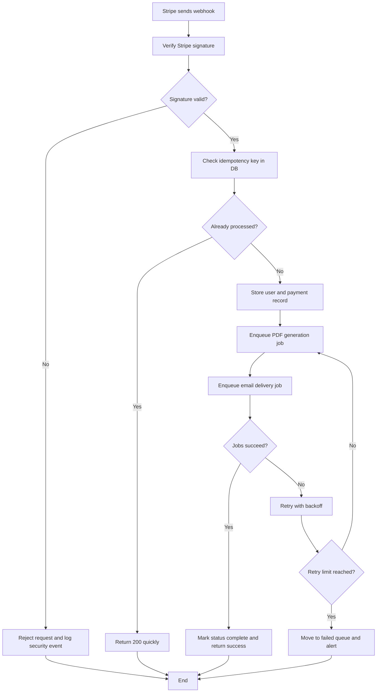

# Business Flowchart for SaaS MVP Backend

 Business parts]
1) Traffic and checkout entry
2) Stripe payment and webhook event
3) Data persistence in database
4) PDF generation
5) Email delivery
6) Personal update link flow
7) Regeneration and support monitoring
----
 Part-by-part explanation]
- **Traffic and checkout entry**: User lands on Framer page and starts purchase. Input is user intent; output is Stripe checkout session.
- **Stripe payment and webhook event**: Stripe confirms payment and sends webhook. Input is `checkout.session.completed`; output is backend trigger.
- **Data persistence in database**: Backend stores purchase/user state. Input is webhook payload; output is normalized record with status.
- **PDF generation**: System builds custom PDF from stored inputs. Input is user data/template; output is generated file URL or blob.
- **Email delivery**: System sends PDF and update link. Input is generated PDF + email template; output is user notification.
- **Personal update link flow**: User opens secure link and edits data. Input is signed token; output is updated record and regen request.
- **Regeneration and support monitoring**: System regenerates PDF and logs retries/errors. Input is update action/failures; output is stable ops view.
----
 Most important section]
Most important section is **Stripe webhook to automation orchestration** because this is the core bottleneck and failure point. If idempotency, retries, and async processing are not clean here, users get duplicate emails, missing PDFs, or broken trust.
----
 Flowchart]

----
 Improvement ideas]
1) Add strict webhook idempotency and unique event constraints.
2) Keep webhook response short by moving heavy tasks to queue workers.
3) Add visible status states for support (`received`, `processing`, `emailed`, `failed`).
4) Add automatic retry with capped attempts and dead-letter queue.
5) Add alerting for repeated webhook verification failures.
