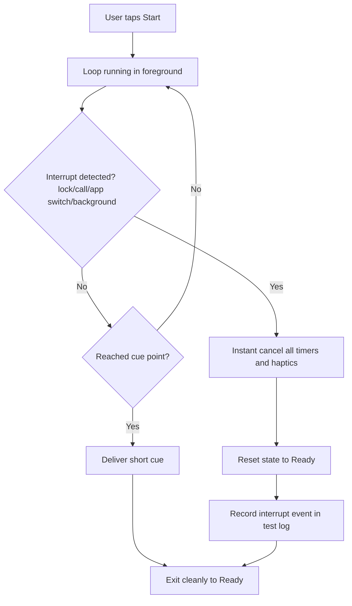

# Business parts
1) User acquisition and trust
2) Onboarding and expectation setting
3) Reset execution loop (core product moment)
4) Interrupt safety handling (Kill Gate)
5) Subscription and restore flow
6) Legal/compliance and wording governance
7) Proof and milestone acceptance workflow

----

# Part-by-part explanation
- **User acquisition and trust:** User discovers a focused golf tool. Input: store listing and claims. Output: install intent.
- **Onboarding and expectation setting:** User learns one-tap behavior and blind-operable use. Input: first launch copy. Output: ready state.
- **Reset execution loop:** User starts reset and receives cue without UI dependence. Input: tap start. Output: calmer focus shift.
- **Interrupt safety handling:** Any lock/switch/background must stop flow instantly. Input: lifecycle/state change. Output: immediate safe ready state.
- **Subscription and restore flow:** User can trial/purchase/restore with clear disclosure. Input: store status. Output: access state.
- **Legal/compliance and wording governance:** App avoids prohibited framing and keeps legal links live. Input: copy and links. Output: approval-ready content.
- **Proof and milestone acceptance workflow:** Every gate is verified by test evidence. Input: logs/videos. Output: pass/fail decision.

----

# Most important section
The most critical section is **Interrupt safety handling (Kill Gate)** because failure here breaks trust instantly during real golf moments and can fail the project at M1 before later gates even matter.

----

# Flowchart

----

# Improvement ideas
1) Keep one explicit `stopNow()` path called by all interrupt events to avoid edge-case drift.
2) Add automated stress script checklist for 50-cycle runs per device before manual video capture.
3) Log stop-latency timing internally to catch non-instant exits early.
4) Add a post-cue hard stop guard so no zombie haptics can continue after flow exit.
5) Use gate-specific acceptance sheet so evidence maps directly to M1 PASS criteria.
