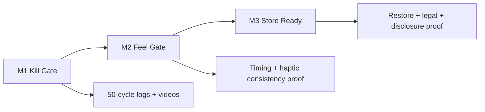

# Version A - With Diagram
Goal: Show how I will de-risk Kill Gate first, then pass Feel and Store gates with proof.
Time split: 0:00-0:15 opening, 0:15-0:55 plan + diagram, 0:55-1:20 proofs + close.
Script:
- Opening line: The biggest risk here is not UI, it is interrupt safety; one missed stop event can break trust fast.
- Point 1: I will build M1 first with a single stop path that all lifecycle interrupts call.
- Point 2: Then I tune M2 feel on real devices only, with one controlled iteration.
- Point 3: Then M3 store flow: trial, restore, legal links, and wording audit with proof.
- Point 4: Every gate is binary pass/fail with your required logs and videos.
- Closing CTA: If this structure works for you, I will share day-by-day execution and exact device matrix in the first PR plan.
Diagram:

Step-by-step recording actions:
1) Prepare: open job post, a simple gate checklist, and the diagram.
2) Show first: gate list with M1 highlighted as priority.
3) First 10-15s: explain project failure risk (interrupt handling).
4) Middle: walk through diagram and how each gate gets proof.
5) Final 10-15s: mention exact proof format and binary pass model.
6) CTA: ask client to confirm device matrix and trial config so work starts immediately.

----

# Version B - No Diagram
Goal: Give a direct, technical, no-fluff plan aligned to locked scope.
Time split: 0:00-0:12 opening, 0:12-0:50 execution approach, 0:50-1:15 proof + close.
Script:
- Opening line: Your project succeeds or fails at reliability, so I treat Kill Gate as the first and strictest gate.
- Point 1: I target lock, inactive, paused, app switch, and background transitions with one immediate cancel routine.
- Point 2: I validate with 50-cycle stress runs and timestamped logs on 2 Android plus 1 iPhone.
- Point 3: For feel, I keep no countdown UI, stable loop timing, and consistent cue delivery under device variance.
- Point 4: For store readiness, I match paywall disclosure to store config and prove restore on both platforms.
- Closing CTA: If you want, I can send the exact test script format I use for M1/M2 proof capture.
Step-by-step recording actions:
1) Prepare: open a short note with M1/M2/M3 bullets.
2) Show first: locked scope bullets to confirm no scope creep.
3) First 10-15s: state the core failure risk and your prevention.
4) Middle: explain gate-by-gate technical actions and proof method.
5) Final 10-15s: restate binary pass criteria and delivery discipline.
6) CTA: ask for preferred start date and required device models confirmation.

----

# Version C - Screen Share + Camera
Goal: Build trust with clear communication, technical confidence, and practical delivery steps.
Time split: 0:00-0:15 camera intro, 0:15-0:55 screen walkthrough, 0:55-1:25 close + next step.
Script:
- Opening line: The risk is simple: if the reset does not stop instantly on interrupt, users lose trust.
- Point 1: I build the core reset as offline-first and blind-operable, with haptics as primary signal.
- Point 2: I enforce clean exit after cue, with no extra interaction theater.
- Point 3: I run proof-driven delivery only: videos, logs, and pass/fail per gate.
- Point 4: I keep dependency count controlled and store policy wording clean from day one.
- Closing CTA: I’m ready to start with M1 immediately after you confirm final device list and subscription config.
What to show on screen at each step:
- Step 1: Job post section with locked non-negotiables.
- Step 2: A small checklist: Kill events, stress cycles, proof artifacts.
- Step 3: Store-readiness checklist: restore, legal links, disclosure match.
- Step 4: Device matrix table placeholder (Android flagship, Android mid/low, iPhone).
Step-by-step recording actions:
1) Prepare: camera on, concise checklist, and one page with gate proofs.
2) Show first: your face for trust, then switch to locked requirements on screen.
3) First 10-15s: state risk-first framing and your reliability-first approach.
4) Middle: walk through exact gate execution and proof assets.
5) Final 10-15s: summarize timeline and fixed-scope execution discipline.
6) CTA: ask client to greenlight M1 and share target test devices with OS versions.
