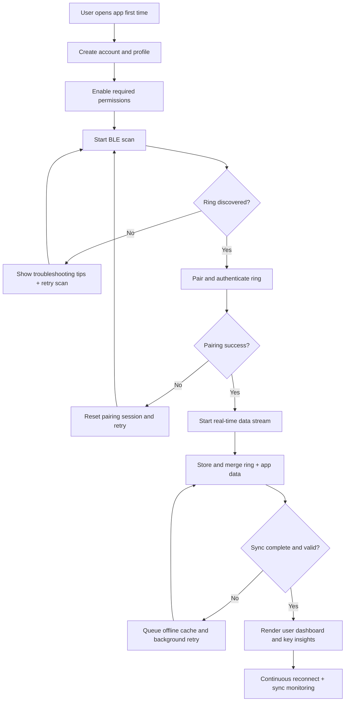

# Business Flowchart - Smart Ring App Project

 Business parts]
1) Marketing and acquisition  
2) Purchase and fulfillment  
3) App onboarding and account setup  
4) Ring pairing and data sync  
5) Data processing and insight generation  
6) Daily engagement and retention  
7) Support and issue resolution
----
 Part-by-part explanation]
- Marketing and acquisition: brings potential users to the product page. Input: campaigns/content. Output: qualified traffic.
- Purchase and fulfillment: user buys ring and receives it. Input: checkout/order ops. Output: delivered hardware.
- App onboarding and account setup: user creates account and profile. Input: app install + user info. Output: ready-to-use account.
- Ring pairing and data sync: app connects to ring over BLE and starts real-time + background sync. Input: hardware + permissions. Output: usable sensor stream.
- Data processing and insight generation: raw device/app data is merged and transformed into understandable outputs. Input: multi-source events. Output: user-facing insights.
- Daily engagement and retention: reminders, dashboards, and progress tracking keep users active. Input: insight outputs + behavior loops. Output: repeat usage.
- Support and issue resolution: solves pairing, battery, sync, and account issues. Input: user problems. Output: recovered trust.
----
 Most important section]
Ring pairing and data sync is the most critical section. If BLE pairing, reconnect logic, and sync reliability fail, the product feels broken even if design and insights are strong.
----
 Flowchart]

----
 Improvement ideas]
1) Add auto-reconnect strategy with backoff to reduce manual reconnect attempts.  
2) Use local queue for offline writes so no sensor data is lost on weak network.  
3) Add source-level validation (ring timestamp, duplicate packet checks).  
4) Provide in-app "connection quality" status to reduce support tickets.  
5) Trigger smart fallback mode when BLE is unstable (partial sync + clear user message).
