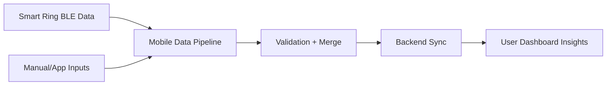

# Loom Video Script - Smart Ring Meets App

 Version A - With Diagram]
Goal: Show how I will build a stable ring-to-app data pipeline without changing your finalized design.  
Time split: 0:00-0:15 intro, 0:15-0:55 architecture + diagram, 0:55-1:20 delivery plan, 1:20-1:35 close

Script:
Opening line:  
"The biggest risk in this project is unstable BLE sync. If data drops, users lose trust fast. I will focus first on connection stability and clean data merge logic."

Main talking points:
1) Your UI/UX is already ready, so I will implement screens exactly as designed.  
2) I will build a reliable BLE layer with reconnect and sync retry logic.  
3) Ring data and app input data will be merged into one clean timeline model.  
4) Backend integration will support auth, profile, secure storage, and fast dashboard rendering.  
5) I have done similar mobile + hardware sync work and know where failures usually happen.

Closing CTA:  
"If you want, I can send a 10-day technical milestone plan next, including testing checkpoints for BLE reliability."

Diagram:

Step-by-step recording actions:
1. Prepare: Open your proposal notes and a simple architecture sketch.
2. Show first: A one-screen flow diagram.
3. First 10-15 seconds: Explain the main risk (BLE reliability).
4. Middle: Walk through how data moves and where retries happen.
5. Final 10-15 seconds: Share timeline confidence and communication style.
6. CTA: Ask for a short technical call to confirm BLE protocol details.
----
 Version B - No Diagram]
Goal: Give a short direct pitch focused on delivery confidence and risk control.  
Time split: 0:00-0:12 intro, 0:12-0:55 execution approach, 0:55-1:20 milestones, 1:20-1:30 close

Script:
Opening line:  
"This project can fail if ring data is not stable in real use. My first priority is reliable BLE connection and safe data sync."

Main talking points:
1) I will build from your ready UI/UX, so design quality stays intact.  
2) I will implement pairing, reconnect, packet validation, and offline queue.  
3) I will merge ring signals and manual app entries into one user-friendly model.  
4) I will connect backend auth/profile/data APIs and keep performance smooth.  
5) I will test on real devices with connection edge cases before release.

Closing CTA:  
"Share your ring BLE spec and backend endpoints, and I can give you a precise milestone breakdown within 24 hours."

Step-by-step recording actions:
1. Prepare: Keep talking points as 5 short bullets.
2. Show first: Job post and your milestone checklist.
3. First 10-15 seconds: Name the core risk and your prevention method.
4. Middle: Explain build flow from pairing to dashboard.
5. Final 10-15 seconds: Mention testing and reporting cadence.
6. CTA: Request BLE docs + API docs to start quickly.
----
 Version C - Screen Share + Camera]
Goal: Build trust by combining face-to-face clarity with technical screen walkthrough.  
Time split: 0:00-0:15 camera intro, 0:15-0:55 screen walkthrough, 0:55-1:25 timeline and scope, 1:25-1:40 close

Script:
Opening line:  
"The product vision is strong. The key technical risk is data reliability between ring, app, and backend, and that is exactly where I can help."

Main talking points:
1) On camera: Explain you will execute their existing design, not redesign it.  
2) On screen: Show pairing flow, sync logic, and data merge model.  
3) On screen: Show phased delivery (MVP core flow first, then optimization).  
4) On camera: Mention similar wearable/mobile integration experience briefly.  
5) On camera: Confirm clear weekly progress updates and QA checkpoints.

Closing CTA:  
"If this sounds aligned, let's do a short call and lock scope so I can start with Milestone 1 immediately."

What to show on screen at each step:
1) Job summary and key requirements checklist  
2) Simple BLE + app + backend architecture view  
3) Milestone board with timeline  
4) Test checklist (pairing, sync loss, reconnect, dashboard render)

Step-by-step recording actions:
1. Prepare: Camera framing, quiet audio, architecture slide, milestone board.
2. Show first: Camera for human intro, then switch to screen.
3. First 10-15 seconds: State risk-first opening with confidence.
4. Middle: Walk through flow and timeline while screen sharing.
5. Final 10-15 seconds: Return to camera and ask for a scope call.
6. CTA: Offer immediate start after receiving BLE/API documentation.
