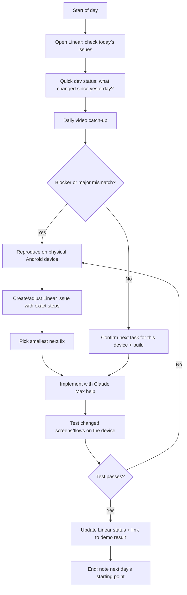

# Business Flowchart - Daily Catch-up Loop

## Business parts
1. Repo/codebase handoff
2. Day-1 audit + MVP scope alignment
3. Daily video catch-up + task planning (Linear)
4. Implementation on the Flutter codebase (Claude Max assisted)
5. Test on physical Android device
6. Update Linear + record blockers
7. End-of-day handoff for the next day

----

## Part-by-part explanation
1. Repo/codebase handoff: Input is the existing Flutter repo and any prior notes. Output is a working local setup.
2. Day-1 audit + MVP scope alignment: Input is the current state of screens/features. Output is a short “next 10 issues” list in Linear.
3. Daily video catch-up + task planning (Linear): Input is progress so far + new blockers. Output is the next day’s exact plan.
4. Implementation: Input is the selected Linear issues. Output is code changes ready to test.
5. Test on physical Android device: Input is the changed build. Output is confirmed behavior (or confirmed bug report).
6. Update Linear + record blockers: Input is test results. Output is clear status and next actions.
7. End-of-day handoff: Input is what’s next. Output is a smooth start for tomorrow.

----

## Most important section
Daily video catch-up + task planning is the core bottleneck because daily reliability is explicitly required, and scope can drift quickly in a short 1-month window.

----

## Flowchart

----

## Improvement ideas
1. Keep catch-up length fixed (for example 15 minutes) and move longer discussions to the issue comments.
2. Require every Linear task to include “tested flow” text (which screen/action was verified).
3. Use a standard “demo format” every day: 1) what you changed 2) what you tested 3) what’s next.
4. If the repo is missing a clean run path, spend Day-1 on getting “one command local setup” working.
