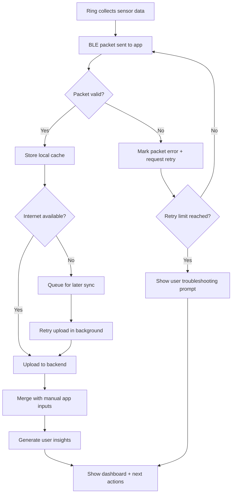

# Business Flowchart - Smart Ring App

## Business parts
1) Acquisition
2) Purchase + device setup
3) Ring-to-app data sync
4) Data processing + insight generation
5) User action loop (habits, manual input, feedback)
6) Retention + subscription
7) Support + device troubleshooting

----

## Part-by-part explanation
- Acquisition: user discovers product through ads, content, or referrals. Input: traffic. Output: product interest.
- Purchase + setup: user buys ring and installs app. Input: order + app install. Output: activated account and paired device.
- Ring-to-app data sync: ring sends live data over BLE. Input: sensor stream. Output: clean synced records.
- Data processing + insight generation: backend/app computes trends and summaries. Input: raw + manual data. Output: useful insights.
- User action loop: user logs context and follows suggestions. Input: insights. Output: behavior change and stronger value.
- Retention + subscription: user keeps using app, may upgrade. Input: ongoing value. Output: revenue and lower churn.
- Support + troubleshooting: solve sync or battery issues fast. Input: user issues. Output: reduced churn and higher trust.

----

## Most important section
The most important section is **Ring-to-app data sync**. If sync is unstable, data becomes incomplete, insights lose trust, and users churn quickly even if UI is strong.

----

## Flowchart

----

## Improvement ideas
1) Add packet checksum + sequence IDs to detect missing data fast.
2) Add automatic reconnect strategy with exponential retry for BLE drops.
3) Add local-first storage so dashboard still works during poor internet.
4) Add sync health analytics for internal monitoring (drop rate, retry count, delay).
5) Add user-facing sync diagnostics page to reduce support friction.
