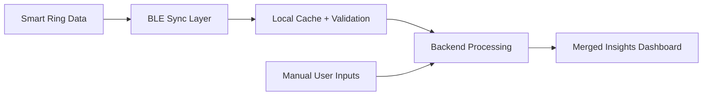

# Loom Video Script - Smart Ring Mobile App Project

## Version A - With Diagram
Goal: Show I can de-risk BLE sync + deliver clean app build from ready UI/UX.
Time split: 0:00-0:15 opening, 0:15-0:55 approach, 0:55-1:20 plan + CTA
Script:
- "The biggest risk in this project is not UI, it is unstable ring-to-app sync. If sync breaks, user trust drops fast."
- "Your designs are ready, which is great. I can focus fully on reliable BLE communication, clean data merge, and smooth app performance."
- "I usually build this in three tracks: BLE reliability, data pipeline, and insight screens exactly from your design."
- "I have delivered mobile builds where hardware data and user inputs were merged into one clear dashboard without confusing the user."
- "If useful, I can start with a short technical spike to validate ring communication before full development."
Diagram:

Step-by-step recording actions:
1) Prepare: open job post, one architecture sketch, and one similar app screen.
2) Show first: the simple diagram and point to sync-risk first.
3) First 10-15s: explain failure risk and how you prevent it.
4) Middle: explain 3-track build plan (BLE, data, UI implementation).
5) Final 10-15s: mention quick technical spike and delivery milestones.
6) CTA: ask for BLE protocol docs + design files to start within 48 hours.

----

## Version B - No Diagram
Goal: Give a direct pitch focused on execution and risk control.
Time split: 0:00-0:12 opening, 0:12-0:50 fit + method, 0:50-1:15 close
Script:
- "Main risk here is BLE data quality. I focus on that first so your insights stay accurate."
- "Since your UI/UX is final, I will implement screens as-is and spend most effort on sync stability, retries, offline queue, and data merge logic."
- "I can deliver this in milestones: pairing + auth, real-time sync, dashboard and insights, then QA and launch prep."
- "I have built cross-platform app features with authentication, profile flows, backend integration, and device-linked data handling."
- "If you share your BLE packet structure, I can quickly confirm timeline and fixed scope."
Step-by-step recording actions:
1) Prepare: open notes with 4 talking points and milestone list.
2) Show first: Upwork job post and highlight "design finalized" section.
3) First 10-15s: call out BLE reliability as top risk.
4) Middle: explain milestone execution in simple words.
5) Final 10-15s: mention immediate start and first checkpoint timing.
6) CTA: ask for short call plus technical docs handoff.

----

## Version C - Screen Share + Camera
Goal: Build trust through face-to-face communication plus clear technical plan.
Time split: 0:00-0:15 intro, 0:15-0:55 execution plan, 0:55-1:25 close
Script:
- "The project can fail if ring sync is weak, even with perfect design. I solve that first."
- "You already completed UI/UX, so I can build fast and keep visual output aligned with your screens."
- "My approach is simple: stable BLE layer, validated data merge, then clear user insights."
- "I suggest four milestones with weekly check-ins so progress is always visible."
- "I can begin with a small pairing + sync proof and then continue full app build."
What to show on screen at each step:
- Step 1: your camera + the job post title.
- Step 2: quick milestone list in a note document.
- Step 3: simple data flow sketch (ring -> app -> backend -> dashboard).
- Step 4: close on calendar availability and next action.
Step-by-step recording actions:
1) Prepare: clean desktop, milestone note, and one architecture sketch.
2) Show first: camera + job post to make it personal and specific.
3) First 10-15s: state the risk and prevention approach.
4) Middle: share screen, walk through milestones and flow.
5) Final 10-15s: confirm start window and communication style.
6) CTA: "Send BLE docs + design package, and I will return a build plan within 24 hours."
