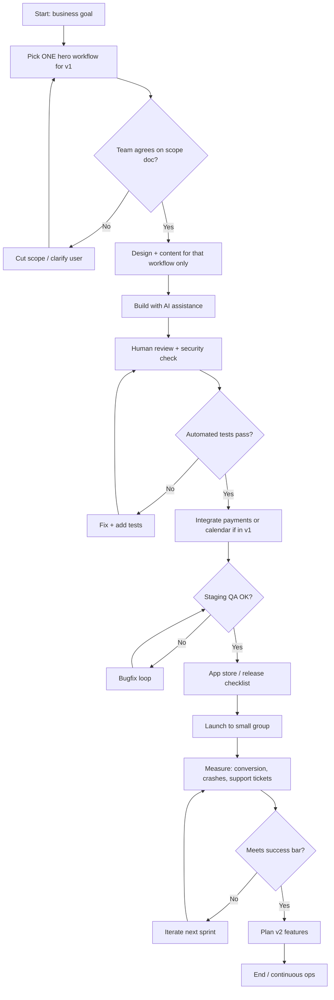

# Business Flowchart — Coaching / Consulting App Delivery

## Business parts

1. **Discovery & positioning** — Who the app is for, promise, and what problem it solves.  
2. **Scope & MVP** — One hero workflow, features cut list, success metrics.  
3. **Design & content** — Brand, copy, media, legal (terms, privacy).  
4. **Build (AI-assisted)** — Architecture, Claude-accelerated implementation, code review.  
5. **Integrations** — Auth, payments, calendar, email/push, analytics.  
6. **QA & launch** — Test plans, store listings, rollout.  
7. **Operations** — Support, updates, metrics, content changes.

----
## Part-by-part explanation

- **Discovery:** Aligns the team on **user** and **offer**; output is a short brief.  
- **Scope & MVP:** Turns the brief into **shippable v1**; output is backlog + milestones.  
- **Design & content:** Makes the app **trustworthy and usable**; output is screens + assets.  
- **Build:** Delivers software; output is **tested builds** and documentation.  
- **Integrations:** Connects the app to **money and calendars**; output is working flows and keys stored safely.  
- **QA & launch:** Reduces bad reviews and refunds; output is **live apps** and monitoring.  
- **Operations:** Keeps the product working after launch; output is a **light process** for fixes and content.

----
## Most important section

**Scope & MVP (plus honest AI workflow)** is the bottleneck. If “use Claude for everything” becomes **undocumented, untested code**, the project looks fast early and **breaks under real users**. Locking **one hero workflow** and **definition of done** (tests, review, release) protects quality and timeline.

----
## Flowchart

**Assumptions:** v1 is narrow; “Claude” accelerates coding but **does not replace** product decisions, review, or store compliance.

----
## Improvement ideas

1. **Write a “definition of done”** for every feature: tests, review, and who merges.  
2. **Weekly demo** of the hero workflow on a real phone — catches UX issues early.  
3. **Secrets policy** — API keys only in secure storage; never pasted only into chat logs.  
4. **Rollback plan** — feature flags or staged rollout so a bad build does not tank launch week.  
5. **Support inbox** — one place for client issues so patterns feed the next sprint.
