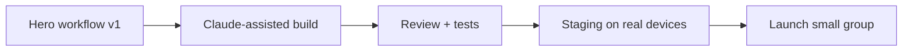

# Loom Video Script — App Development Using Claude.ai (Speaking / Coaching Business)

----
## Version A — With Diagram

**Goal:** Show you can **lead** an AI-assisted build for their industry without hiding risks.

**Time split:** 0:00–0:15 hook | 0:15–0:55 plan + diagram | 0:55–1:15 proof + CTA

**Script:**  
You posted that you want a new app for your speaking and coaching business, with **Claude doing the coding work** and you need someone to **manage delivery** with your team. The risk is not speed — it is **unclear scope** and **weak review**, which breaks trust with paying clients. I would start by locking **one hero workflow** for version one — for example: **see offer → book → pay → get prep materials**. Everything else waits. I would use Claude to move fast on implementation, but keep a clear loop: **spec → build → human review → tests → release**. That way you get velocity without fragile code.

**Diagram:**

**Step-by-step recording actions:**

1. **Prepare:** Open their job text in a tab; have the diagram ready in another tab or slide.  
2. **First screen:** Your Upwork proposal draft or a simple slide title: “Hero workflow + safe AI delivery.”  
3. **First 10–15 seconds:** State the risk (scope/review), then the fix (one workflow + review loop).  
4. **Middle:** Walk the diagram in plain words; tie one line to **speakers/coaches** (booking + trust).  
5. **Close 10–15 seconds:** Offer a **30-minute scoping call** to pick the hero workflow together.  
6. **CTA:** “Invite me and suggest two times this week — I will reply with a tight agenda.”

----
## Version B — No Diagram

**Goal:** Sound direct and calm; no slides required.

**Time split:** 0:00–0:20 risk | 0:20–0:55 plan | 0:55–1:10 CTA

**Script:**  
You want an app for your professional speaking and coaching business, built with **Claude handling coding** while someone **owns delivery** with your team. That setup works if the manager is strict about **scope and quality**. The failure mode is building many half-finished features because AI makes coding feel cheap. I would agree on **one end-to-end user path** for version one, then expand. On the tech side, I am comfortable with **mobile plus Python backends** when needed, and with **Claude in the loop** for faster iteration — always with **review, security checks, and testing** before anything client-facing goes live. If that matches how you want to work, I would like to **align on MVP**, **timeline**, and **who approves releases** in the first week.

**Step-by-step recording actions:**

1. **Prepare:** Quiet space; test mic; close noisy tabs.  
2. **First screen:** Upwork job page or blank doc with three bullets you will hit.  
3. **First 10–15 seconds:** Name their industry and the “manager of Claude” model; state the main risk.  
4. **Middle:** MVP discipline + your stack fit (Android, iOS, Python, AI integration).  
5. **Close 10–15 seconds:** First week: MVP, roles, release approval.  
6. **CTA:** Ask them to **send invite** and **their top business outcome** for the app.

----
## Version C — Screen Share + Camera

**Goal:** Build trust with **face + screen**; show you can run a structured process.

**Time split:** 0:00–0:15 face | 0:15–0:50 screen | 0:50–1:10 face CTA

**Script:**  
**Face:** Thanks for the clear post — app for **speaking/coaching**, **Claude-accelerated build**, you need a **delivery lead**. **Screen:** Here is how I would run week one: a **one-page scope** with **one hero workflow**, a **simple architecture sketch**, and a **weekly demo** on a real phone. **Face:** I integrate Claude where it helps, but I do not ship without **review and tests** — your clients expect reliability. **Screen (optional):** Show a blank doc with headings: Goal, User, Hero workflow, Out of scope, Launch criteria. **Face CTA:** Invite me and tell me whether **payments** and **calendar** must be in v1 — I will reply with a concrete week-one plan.

**What to show on screen at each step:**

| Step | Show |
|------|------|
| Opening | Your face + smile; then split or full screen share |
| Week-one plan | Doc or slide with 4–5 headings only |
| Closing | Back to camera for CTA |

**Step-by-step recording actions:**

1. **Prepare:** Loom camera on; share **one window** only; hide unrelated notifications.  
2. **First screen:** Start on camera; switch to **shared doc** when you say “week one.”  
3. **First 10–15 seconds:** Face: repeat their need in one sentence.  
4. **Middle:** Screen: walk headings slowly; no dense text.  
5. **Close 10–15 seconds:** Camera: ask for **invite + two constraints** (payments/calendar).  
6. **CTA:** “Reply with your v1 must-haves — I will map a two-week slice.”
