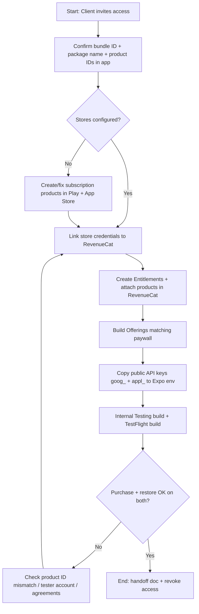

# Business Flowchart: Store + RevenueCat Purchase Path

## Business parts

1. **Access & identity** — Client invites admin access; correct Google/Apple/RevenueCat accounts.  
2. **Google Play** — App, subscription products, license testers, Internal Testing track, Play Developer API linked to RevenueCat (service account JSON).  
3. **Apple** — App record, subscription group, IAP products, agreements/tax/banking, Sandbox testers, TestFlight build, App Store Connect API key or shared secret in RevenueCat as required.  
4. **RevenueCat** — Apps (iOS + Android), entitlements, store products, offerings, linking to Play/App Store.  
5. **Client app (Expo)** — Public API keys in env, correct product IDs / offering used by paywall (already integrated).  
6. **Verification** — Test purchase, restore, entitlement unlock on Android Internal Testing and iOS TestFlight.

----

## Part-by-part explanation

**Access & identity**  
Purpose: allow configuration without blockers. Input: invites, bundle ID/package name. Output: ability to edit all three systems.

**Google Play**  
Purpose: sell subscriptions on Android. Input: merchant setup, base plans, testers. Output: live subscription SKUs and test installs from Internal Testing.

**Apple**  
Purpose: sell subscriptions on iOS. Input: paid apps agreement, subscription metadata, sandbox testers. Output: products visible to TestFlight + sandbox purchases.

**RevenueCat**  
Purpose: unify entitlements and receipt logic. Input: store credentials + product IDs. Output: `goog_...` / `appl_...` keys and matching offerings for the app.

**Client app**  
Purpose: show paywall and unlock features. Input: public keys, offering configuration. Output: successful test transactions in QA tracks.

**Verification**  
Purpose: prove end-to-end flow. Input: test accounts and builds. Output: documented proof (screens/logs) for handoff.

----

## Most important section

**RevenueCat product ↔ store alignment** is the core bottleneck. If Play or App Store product IDs, base plans, or subscription groups do not match what RevenueCat and the app expect, **nothing will validate**—even with perfect credentials. Credentials get you API access; **exact ID matching** gets you purchases.

----

## Flowchart

----

## Improvement ideas

1. **Single spreadsheet** listing entitlement, Android product/base plan, iOS product ID, RevenueCat product identifier, and offering placement—update once when anything changes.  
2. **Agreements first on Apple** (Paid Applications, banking, tax)—blocks IAP visibility even if products exist.  
3. **License testers on Play** and **sandbox Apple IDs on iOS** prepared before the verification call to save time.  
4. **Screenshot or Loom** of RevenueCat customer view after a test purchase—helps the client reproduce issues later.  
5. **Rotate or remove** collaborator access immediately after handoff; keep the client as sole owner of API keys and JSON (they store secrets; you only guide).
