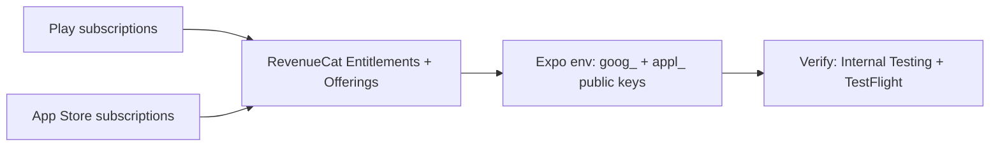

# Loom Video Script: RevenueCat + Play + App Store Setup

----

## Version A - With Diagram

**Goal:** Show you can finish store + RevenueCat setup and verification without touching app code, and reduce the risk of product ID mismatch.

**Time split:**  
0:00–0:15 Risk + goal  
0:15–0:55 Diagram + what you will configure  
0:55–1:15 Proof + next step  

**Script:**  
You already integrated RevenueCat and paywalls—that is the hard part in code. The project usually fails here when Play and App Store product IDs do not match RevenueCat entitlements and offerings. I start by writing down every product ID from the app and the dashboard, then I align Play base plans, App Store subscription products, and RevenueCat so one entitlement unlocks the same feature on both platforms. I link the Play service account JSON and Apple credentials in RevenueCat, then I give you the public `goog_` and `appl_` keys for Expo. Last, we verify on Internal Testing and TestFlight with real test accounts. I have done React Native and Expo IAP setups; no Native Express–specific code is required for this task.

**Diagram:**

**Step-by-step recording actions:**

1. **Prepare:** Job post on screen; optional RevenueCat docs tab (not required to read aloud).  
2. **Show first:** Your Upwork proposal or a simple slide with the diagram.  
3. **First 10–15 seconds:** Say the main risk (ID mismatch) and that you fix it before touching testers.  
4. **Middle:** Walk the diagram left to right; mention service account JSON and Apple linking without reading secrets.  
5. **Close 10–15 seconds:** Say deliverables: keys, short checklist, both stores verified.  
6. **CTA:** Ask them to send invites and confirm bundle ID, package name, and current product IDs.

----

## Version B - No Diagram

**Goal:** Reassure them you own the full console workflow and testing, not just theory.

**Time split:**  
0:00–0:15 Risk  
0:15–0:55 Plan  
0:55–1:15 Proof + CTA  

**Script:**  
Most failures here are not the SDK—they are wrong subscription setup or products that do not match RevenueCat. I will configure Google Play: subscriptions, license testers, Internal Testing track, and the service account JSON linked in RevenueCat. On Apple I will set up subscriptions under the right group, finish anything blocking IAP such as agreements, add sandbox testers, and connect App Store Connect to RevenueCat. In RevenueCat I will create the apps, entitlements, products, and offerings to match your paywall. Then I will give you the exact public API keys for your `.env` and Expo build. We will confirm purchases and restore on Internal Testing and TestFlight. I work with React Native and Expo regularly; your stack fits that. After verification, you can remove my access.

**Step-by-step recording actions:**

1. **Prepare:** Quiet space; face or screen only—your choice.  
2. **Show first:** Your profile or one bullet list of tasks from the job.  
3. **First 10–15 seconds:** State the risk and your fix in one sentence.  
4. **Middle:** Walk through Google, Apple, RevenueCat, keys, verification—no jargon dump.  
5. **Close 10–15 seconds:** Repeat deliverables and timeline.  
6. **CTA:** Invite them to share invites and product IDs.

----

## Version C - Screen Share + Camera

**Goal:** Feel like a short working session—show what “done” looks like in dashboards (without exposing secrets).

**Time split:**  
0:00–0:15 Camera: risk  
0:15–0:45 Screen: RevenueCat + stores (blurred or demo)  
0:45–1:15 Camera: proof + CTA  

**Script:**  
**Face:** The biggest risk is store products and RevenueCat getting out of sync. I lock IDs first, then connect accounts.  
**Screen:** Here is RevenueCat—apps for Android and iOS, entitlements, products, offerings. I mirror what is in Play Console and App Store Connect. Here is where Play’s service account ties in; here is Apple’s connection. I never put private keys in chat; you keep JSON and secrets in your vault.  
**Face:** I deliver public `goog_` and `appl_` keys for Expo, and we test on Internal Testing and TestFlight.  
**Closing:** Send admin invites and your bundle ID, package name, and product list—then we schedule verification.

**What to show on screen at each step:**

| Step | On screen |
|------|-----------|
| Opening | Your face; then switch to job post snippet |
| Middle | RevenueCat or official doc diagram (no real keys); or a blank “product ID” table you fill verbally |
| Close | Back to camera or a simple checklist graphic |

**Step-by-step recording actions:**

1. **Prepare:** Test camera + mic; open job post; optional RevenueCat dashboard with test project or demo.  
2. **Show first:** Face + one-line problem statement.  
3. **First 10–15 seconds:** Risk + “IDs first.”  
4. **Middle:** Screen share; point to Apps, Entitlements, Products, Offerings; mention Play JSON and Apple linking without showing credentials.  
5. **Close 10–15 seconds:** Deliverables: keys, env names, both test tracks verified.  
6. **CTA:** Ask for invites and the ID list; offer a short screen-share if needed.
