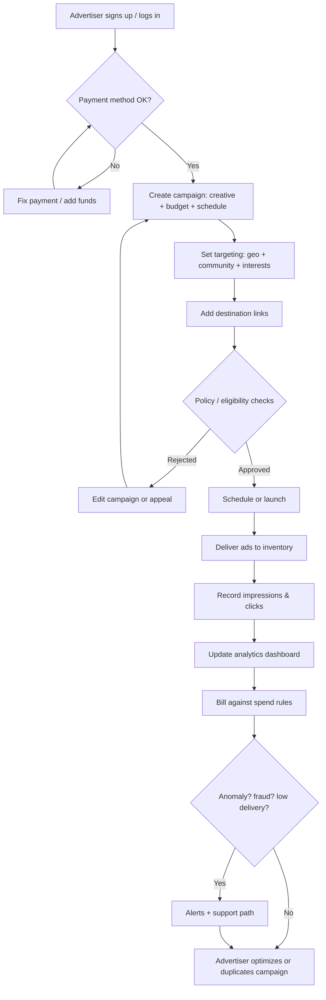

# Business Flowchart — Zenzo Ads

## Business parts

1. **Acquisition** — How advertisers discover Zenzo and start an account.  
2. **Onboarding & identity** — Sign-up, OTP/social login, business profile, payment method.  
3. **Campaign setup** — Creatives (text/image/video), budget, schedule, targeting, destination links.  
4. **Delivery** — Where ads appear (owned app/web, partner surfaces, or network), frequency, compliance.  
5. **Measurement** — Impressions, clicks, engagement, attribution basics.  
6. **Billing & spend** — Holds, charges, receipts, failed payments, refunds.  
7. **Retention & support** — Repeat campaigns, alerts, help when numbers look wrong.

----

## Part-by-part explanation

- **Acquisition:** Inputs = marketing, referrals, partnerships. Output = registered advertiser accounts.  
- **Onboarding & identity:** Inputs = user credentials, verification rules. Output = trusted account ready to pay and publish.  
- **Campaign setup:** Inputs = assets, targeting, schedule. Output = a **ready** or **scheduled** campaign entity in the system.  
- **Delivery:** Inputs = campaign rules + inventory. Output = user-facing ad views and tracked events.  
- **Measurement:** Inputs = delivery events. Output = dashboard metrics and exports.  
- **Billing & spend:** Inputs = delivery + pricing rules. Output = charged wallet/card and invoices.  
- **Retention & support:** Inputs = product usage + tickets. Output = repeat spend and lower churn.

----

## Most important section

**Delivery + measurement** is the core bottleneck. If ads do not show reliably or numbers disagree with reality, **trust dies**—especially for diaspora advertisers comparing you to Meta-level expectations. Billing mistakes are second; bad targeting is third.

----

## Flowchart

----

## Improvement ideas

1. **Event naming discipline** — one schema for impression, click, and outbound link so mobile, web, and future partners do not drift.  
2. **Delivery health panel** — show “eligible audience size,” pacing, and rejection reasons in plain language.  
3. **Spend caps and alerts** — daily caps and email/SMS when 80% spent; reduces billing disputes.  
4. **Replay test mode** — sandbox campaign that never bills but shows fake delivery stats for demos.  
5. **Clear refund path** — documented policy for undelivered inventory or platform errors; builds credibility vs. informal diaspora channels.
