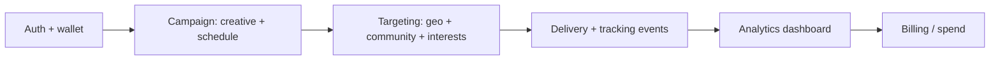

# Loom Video Script — Zenzo Ads (Mobile + Web Ad Platform)

**Assumptions for recording:** You will speak as the freelancer; adjust “I” to your real experience and links.

----

## Version A — With Diagram

**Goal:** Show that you understand the diaspora-ad risk (trust + measurement) and propose a tight MVP path that can grow toward Meta-like depth without copying their scope on day one.

**Time split:**  
0:00–0:15 — Hook + risk  
0:15–0:55 — MVP structure (diagram)  
0:55–1:15 — Proof + collaboration  
1:15–1:30 — Next step

**Opening line:**  
“The biggest risk on a project like Zenzo Ads is building a wide feature list before delivery and analytics feel trustworthy—because diaspora advertisers will compare your numbers to tools they already use.”

**Main talking points:**

1. Zenzo is not only a mobile UI problem; it is an **events + billing + reporting** problem tied to **community targeting**.  
2. MVP should pick **one campaign objective** (for example, traffic to a link) and **one strong creative format** first, then add video and deeper targeting.  
3. Backend contracts for **impressions, clicks, and spend** should stay stable so iOS, Android, and web do not fork.  
4. You want a weekly rhythm: **demo → metrics review → next slice**—especially if this can move contract-to-hire.

**Closing CTA:**  
“Send your MVP must-haves and any wireframes or brand direction. I’ll reply with a 2-week milestone plan and what I need from you on targeting data.”

**Diagram:**

**Step-by-step recording actions:**

1. **Prepare:** Open the job post (or a one-page outline), your calendar, and one example of a similar app or API-heavy product (blur secrets).  
2. **Show first:** The diagram on screen (full screen).  
3. **First 10–15 seconds:** Read the opening line, then point at **Delivery + tracking** on the diagram.  
4. **Middle:** Walk left-to-right on the diagram; pause on **Targeting** and say one sentence on why diaspora taxonomy must be explicit in MVP.  
5. **Close (10–15 seconds):** Summarize weekly cadence; no new features.  
6. **CTA:** End on the exact sentence from **Closing CTA**.

----

## Version B — No Diagram

**Goal:** Sound clear and senior without visuals—useful if you record from a phone or low-friction setup.

**Time split:**  
0:00–0:20 — Risk + focus  
0:20–1:05 — MVP slice + integrations  
1:05–1:30 — CTA

**Opening line:**  
“If Zenzo tries to match Meta’s surface area in the first build, the product usually fails in a quieter place—reporting and spend accounting—because advertisers stop trusting the dashboard.”

**Main talking points:**

1. I’d start with **one advertiser journey**: create ad → pay → launch → see real metrics → adjust budget.  
2. For diaspora positioning, **community targeting** needs a clear v0 list—languages, regions, interest tags—even if the first version is partly manual.  
3. **Payments for ad spend** should pair with **hard spend limits** and clear receipts; that reduces support load early.  
4. I’m comfortable owning **mobile-first UI** while keeping **APIs clean** for web and future inventory partners.

**Closing CTA:**  
“Share your MVP cut line and whether web is required on day one. I’ll propose milestones and a realistic timeline for $3,500 or suggest a phased scope if needed.”

**Step-by-step recording actions:**

1. **Prepare:** Quiet room; paste 4 bullet notes in a doc you can glance at.  
2. **Show first:** Your face or a neutral doc with the four bullets only.  
3. **First 10–15 seconds:** Opening line, then one sentence: “Here’s how I’d keep scope safe.”  
4. **Middle:** Speak the four main points in order; use short pauses between points.  
5. **Close:** Repeat the two decisions you need from them: MVP scope + web yes/no.  
6. **CTA:** Read the closing line slowly.

----

## Version C — Screen Share + Camera

**Goal:** Feel like a product partner: face visible, screen shows structure and specificity.

**Time split:**  
0:00–0:15 — Face + problem  
0:15–0:55 — Screen: simple outline  
0:55–1:15 — Face: collaboration  
1:15–1:30 — Screen: next step text

**Script:**

- **Face (0:00–0:15):** Same opening idea as Version B in your own words—trust in metrics and spend.  
- **Screen (0:15–0:55):** Show a simple outline with headings: Auth, Campaign, Targeting, Delivery events, Analytics, Payments. Say: “This is the backbone; mobile is the main composer, web can follow the same APIs.”  
- **Face (0:55–1:15):** “I care about weekly demos and honest tradeoffs—video ads and advanced segments can wait if we don’t have solid tracking.”  
- **Screen (1:15–1:30):** Show a single line of text: “Next: confirm MVP scope + targeting data source.” Read it aloud.

**What to show on screen at each step:**

| Segment | Camera | Screen |
|--------|--------|--------|
| Open | On | Blank or blurred |
| Backbone | Small bubble or corner | Outline doc or slide |
| Collaboration | On | Same slide |
| Close | Off or small | One-line next step |

**Step-by-step recording actions:**

1. **Prepare:** Start Loom with camera + screen; test mic; hide noisy desktop icons.  
2. **Show first:** Your face; smile neutral; no long intro.  
3. **First 10–15 seconds:** Risk sentence + “I’ll show the system shape on screen.”  
4. **Middle:** Switch to screen; move mouse slowly; read headings, do not speed-read.  
5. **Close:** Back to face for one sentence on collaboration; then screen with next-step line.  
6. **CTA:** Point at the on-screen next-step line and stop talking immediately after.
