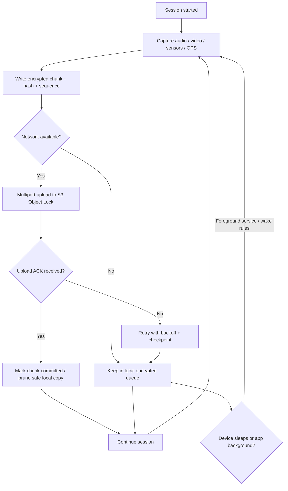

# Business Flowchart — Core Incident & Evidence Pipeline

## Business parts

1. **Session start** — User or system starts a protected trip / monitoring session.  
2. **Capture** — Audio, video, sensors, and location stream locally.  
3. **Local buffer** — Encrypted chunks queued on device (survive crashes and power loss as much as OS allows).  
4. **Cloud ingest (WORM)** — Continuous upload to immutable storage with Object Lock / legal hold as designed.  
5. **Route logic** — Planned route vs live position; detect stops off-route.  
6. **Alerts** — Twilio / WhatsApp / push to trusted contacts via FCM or companion app.  
7. **SOS UI** — Locked-down screen when emergency is active.  
8. **Post-incident** — Audit, retention, support, and maintenance.  

----

## Part-by-part explanation

- **Session start:** Inputs = route plan, contacts, policies. Output = active session state and permissions.  
- **Capture:** Inputs = hardware streams. Output = timestamped media/sensor segments.  
- **Local buffer:** Inputs = segments. Output = durable queue with checkpoints for upload.  
- **Cloud ingest:** Inputs = queue. Output = immutable objects + integrity metadata (hashes, sequence IDs).  
- **Route logic:** Inputs = GPS stream + route polyline. Output = deviation/stop events.  
- **Alerts:** Inputs = events. Output = messages and push notifications with retry rules.  
- **SOS UI:** Inputs = emergency state. Output = restricted UI and escalation.  
- **Post-incident:** Inputs = stored evidence and logs. Output = review, exports, updates.  

----

## Most important section

**Local buffer + WORM upload** is the core bottleneck and value driver. If uploads are not **resumable, ordered, and tamper-evident**, the rest of the app cannot deliver trust. Route and alert logic depends on reliable evidence and stable background behavior.

----

## Flowchart

----

## Improvement ideas

1. **Idempotent uploads** — Use stable object keys and multipart part numbers so retries never duplicate logical evidence.  
2. **Back-pressure** — If upload lags capture, reduce non-critical sensor rate before dropping safety-critical buffers.  
3. **Explicit “session end” handshake** — Finalize manifests so WORM objects form a complete chain for review.  
4. **Separate alert channel from evidence path** — Alerts can fail without blocking immutable storage, and vice versa, with clear user-visible status.  
5. **Power-loss testing** — Automated tests for queue recovery after kill and reboot within platform limits.
