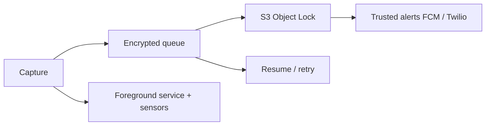

# Loom Video Script — Flutter Security App (WORM, Background, Twilio)

## Version A — With Diagram

**Goal:** Show you understand the risky parts (background capture, immutable upload, WhatsApp production) and a concrete architecture to finish the ~85% prototype.

**Time split:** 0:00–0:15 opening | 0:15–0:55 main | 0:55–1:15 close (~75–90s total)

**Script:**  
You posted a senior Flutter role to take a strong prototype to production: combined capture, WORM-style cloud storage, foreground service for sensors, smarter geofencing, Twilio WhatsApp out of sandbox, hardening, and performance on low-RAM phones. The main failure mode is not “Flutter skill” — it is **fragile background + upload pipeline** that breaks under real travel, lock screen, and bad networks. I focus the plan on an **encrypted local queue**, **multipart uploads with checkpoints**, and **Object Lock** so evidence stays ordered and tamper-evident. For WhatsApp, production means **Meta-approved sender**, proper templates where required, and **retry with idempotency** so users are not spammed on partial failures. I work with your NDA flow, document integrations, and ship an optimized release APK, with iOS if you want that track.

**Diagram:**

**Step-by-step recording actions:**

1. **Prepare:** Quiet room, one tab with your job post bullets, simple slide or whiteboard with the diagram above, portfolio link ready in notes.  
2. **Show first:** Job post or your short agenda list on screen.  
3. **First 10–15s:** Name the risk (background + immutable pipeline), not your resume.  
4. **Middle:** Walk the diagram left to right; mention Android foreground service, queue, S3, then alerts.  
5. **Close 10–15s:** Say you need NDA access to map exact packages to platform policy, then propose a short technical call.  
6. **CTA:** “If you share the repo under NDA, I’ll return a phased estimate and a 2-week cut of milestones.”

----

## Version B — No Diagram

**Goal:** Direct credibility on Flutter + AWS + Twilio + Android services without slides.

**Time split:** 0:00–0:15 | 0:15–0:55 | 0:55–1:15

**Script:**  
I read your brief end to end. You are at ~85% with a heavy feature set: simultaneous capture, continuous upload toward WORM storage, background sensors with a proper Android foreground service, route deviation and stop detection, Twilio WhatsApp moving from sandbox to production, plus obfuscation, root checks, and FCM to trusted contacts. The piece that usually kills schedules is making **recording, networking, and OS background limits** work together on cheap Android hardware — so I’d start by profiling the current pipeline on a 2GB-class device, then tighten Provider rebuilds and sensor rates, then harden the upload queue before polishing SOS UI protections. I’m comfortable documenting S3 Object Lock assumptions, IAM least privilege, and your Twilio production cutover checklist. Hourly fits how you scoped ongoing work; I can give a detailed hour range per milestone after NDA.

**Step-by-step recording actions:**

1. **Prepare:** Close extra apps; have one doc open with 4 milestone headings only.  
2. **Show first:** Your Upwork post or a plain text outline of their eight work areas.  
3. **First 10–15s:** One sentence on why prototypes stall (background + uploads).  
4. **Middle:** Go through their numbered list in order, 20–30 seconds each on items 1–2 and 5–7, shorter on the rest.  
5. **Close:** Quote range awareness ($40–70) and willingness to align with maintenance.  
6. **CTA:** Invite them to send NDA and a Loom walkthrough of the current build.

----

## Version C — Screen Share + Camera

**Goal:** Face + screen trust-building; show you can navigate their stack list on a real IDE or doc.

**Time split:** 0:00–0:20 | 0:20–0:70 | 0:70–0:90

**Script (what to say + what to show):**

| Segment | Say | Show on screen |
|--------|-----|----------------|
| Open | “I’m going to map your eight critical points to a delivery order that de-risks launch.” | Face + shared screen: their job text or a one-page outline. |
| Middle | Walk 1→8 briefly: combine capture + **queue + WORM** first; **foreground service** next; geofencing with clear false-positive rules; Twilio production with retries; perf pass; security; FCM backend. | Split: outline on left, optional `pubspec` or architecture note on right if you have a generic example (no client secrets). |
| Close | “Send the NDA and repo access — I’ll reply with milestones, hours, and risks tied to Play/App Store policy for your jurisdictions.” | Stop at a clear “Next steps” bullet list. |

**Step-by-step recording actions:**

1. **Prepare:** Test camera + mic; hide notifications; blur unrelated tabs.  
2. **Show first:** Your structured outline (not a generic portfolio homepage).  
3. **First 10–15s:** Risk-first line about upload/session reliability.  
4. **Middle:** Scroll the outline while matching to their numbered requirements.  
5. **Close:** One sentence on documentation + signed APK deliverable.  
6. **CTA:** “Reply with NDA and preferred call slot this week.”
