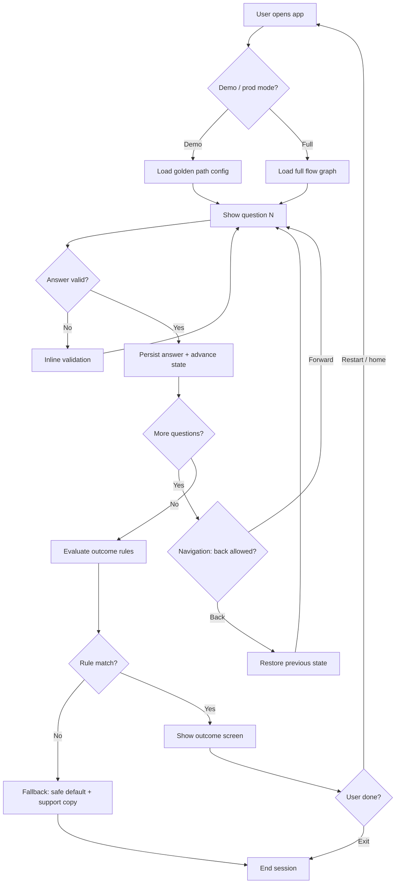

# Business flowchart — Core triage questionnaire (demo-critical path)

## Business parts

1. **Access & trust** — NDA, install/build, maybe login or demo mode.  
2. **Acquisition / entry** — User opens app, lands on intro or first question.  
3. **Onboarding (if any)** — Profile, region, age band, consent — *keep minimal for Monday if possible*.  
4. **Core delivery — triage questionnaire** — Symptom selection, follow-ups, branching logic.  
5. **Decision & routing** — Map answers to outcome (self-care, call doctor, emergency, etc.).  
6. **Retention / follow-up** — Save summary, share, book — *often stubbed for demo*.  
7. **Support & safety** — Disclaimers, “if emergency call 112/911,” error states.  
8. **Payments** — Likely N/A for this milestone.

----
## Part-by-part explanation

| Part | Purpose | Input | Output |
|------|---------|-------|--------|
| Access & trust | Legal + code access | NDA signed | Repo + credentials |
| Entry | Start session | App open | First question or hub |
| Onboarding | Context for rules | User attributes | Qualified branch set |
| Questionnaire | Collect structured data | Taps / inputs | Answer object + next node |
| Decision & routing | Clinical pathway logic | Answer history | Outcome screen |
| Follow-up | Next product step | Outcome | Optional save/share |
| Support & safety | Risk management | Errors, edge cases | Safe copy + escape hatch |

----
## Most important section

**Questionnaire + decision routing** is the core value driver for Monday: if **branching**, **state**, and **outcomes** are stable, the demo works. Visual polish matters second to **no dead ends and no wrong jumps**.

*Assumption:* Logic is already specified; failures will be **implementation gaps** (wiring, state, navigation).

----
## Flowchart

**Failure points called out:** invalid input, missing rule match, app resume mid-flow, back stack inconsistency.

----
## Improvement ideas (for this flow)

1. **Define “resume” behavior explicitly** — Continue vs restart; avoids awkward demo if the app backgrounded.  
2. **Idempotent “next” handler** — Double-taps should not skip questions or duplicate submits.  
3. **Outcome fallback copy** — One safe message if analytics or an edge case hits an undefined node.  
4. **Freeze scope on Friday night** — Only P0 fixes Saturday–Sunday; everything else is a backlog ticket.  
5. **Record a 3-minute screen capture** Sunday PM CET as the rehearsal — catches device-specific bugs early.
