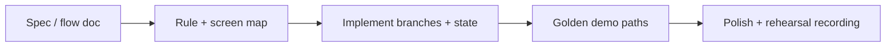

# Loom video script — Health triage app (final touches, Monday CET demo)

----
## Version A — With diagram

**Goal:** Show you understand **demo-deadline delivery** and how you’ll **wire logic + state** without redesigning clinical rules.

**Time split:**  
- 0:00–0:15 — Risk + promise  
- 0:15–0:55 — Plan tied to their task list  
- 0:55–1:15 — Proof + CTA  

**Script:**  
“You’re ~70% there with flows already defined — the risk this weekend isn’t ‘can we design triage,’ it’s **missed wiring**: branching that doesn’t match the spec, navigation that loses answers, or a questionnaire that breaks on back/resume. I’d start by locking a **short demo path**, then implement symptom logic and decision links against that path, fix state issues, and only then polish UI. I’m available **this weekend** and I’m aiming to hand you a **stable build before Monday evening CET**, with a quick screen recording so you’re not debugging live in the room. After NDA I’ll confirm stack and repo access and propose a **P0 checklist** for Monday.”

**Diagram:**

**Step-by-step recording actions:**  
1. **Prepare:** Their job post open; your calendar showing weekend blocks; optional 1 bullet list of P0 tasks.  
2. **First on screen:** Job post or a simple slide with “Implementation + stability (not new algorithms).”  
3. **First 10–15s:** State the risk (wiring/state) and your counter-move (golden path + checklist).  
4. **Middle:** Walk the diagram; map each box to their bullets (symptom logic, flows, navigation, questionnaire).  
5. **Close 10–15s:** Weekend availability + Monday CET buffer + NDA next step.  
6. **CTA:** “Send the NDA — I’ll reply with stack confirmation and a same-day P0 list.”

----
## Version B — No diagram

**Goal:** Straight, calm confidence: you’re the right person for a **compressed implementation** sprint.

**Time split:**  
- 0:00–0:20 — Opening + risk  
- 0:20–1:00 — How you’d execute  
- 1:00–1:15 — Confirmations + CTA  

**Script:**  
“Monday CET demo with a clinical triage app means stakeholders watch **one path at a time** — if anything feels glitchy, trust drops fast. You already defined the logic; I’d treat this as a **delivery sprint**: connect the decision graph to the UI, harden questionnaire state — back, resume, double taps — then tighten demo UI behavior. I’m free **this weekend** for async updates and short calls if needed. I’ve shipped **mobile apps with complex forms and branching flows**; health-adjacent work needs extra care with copy and edge cases, and I’m comfortable working from a written spec. I can target **handoff before Monday evening CET** if materials arrive right after NDA. Next step: NDA, then repo access and the exact demo script.”

**Step-by-step recording actions:**  
1. **Prepare:** Quiet space; know your two strongest relevant projects (one sentence each).  
2. **First on screen:** Your Upwork profile or a blank doc with three headings: Scope / Plan / Availability.  
3. **First 10–15s:** Demo risk + your focus on stability.  
4. **Middle:** Task-by-task echo (symptom logic, flows, nav, UI polish, questionnaire).  
5. **Close 10–15s:** Weekend + Monday CET + NDA.  
6. **CTA:** Ask them to send NDA and name the **one hero user story** for Monday.

----
## Version C — Screen share + camera

**Goal:** Feel like a **real collaborator**: face + concrete plan on screen.

**Time split:**  
- 0:00–0:15 — Camera on, human intro without “Hi I’m…”  
- 0:15–1:00 — Screen: written plan  
- 1:00–1:20 — Camera or split: CTA  

**Script (what to say + what to show):**  

| When | What to say | What to show |
|------|-------------|--------------|
| Open | “Stakeholder demos fail when the **happy path** isn’t bulletproof — you’re past algorithm design, so I’d own **implementation fidelity**.” | Camera + small note: “70% → demo-ready” |
| Transition | “I’d align on three **golden paths**, then wire symptom logic and outcomes, then chase navigation bugs.” | Screen share: simple doc with **P0 / P1** columns |
| Middle | “Weekend I’d send short Looms: morning status, evening build — so Monday CET isn’t a surprise.” | Scroll the P0 list; highlight “state / back / resume” |
| Close | “I’m available this weekend and I’m committing to **before Monday evening CET** once I see the codebase after NDA.” | Calendar or text: “CET handoff target” |

**Step-by-step recording actions:**  
1. **Prepare:** Doc with P0/P1; test camera + mic; hide unrelated tabs.  
2. **Show first:** Face + one-line on-screen title.  
3. **First 10–15s:** Demo risk + golden paths.  
4. **Middle:** Screen share the checklist; speak slowly.  
5. **Final 10–15s:** Confirm weekend + CET + experience in one breath.  
6. **CTA:** “NDA first — then I confirm stack and send today’s P0 list.”
